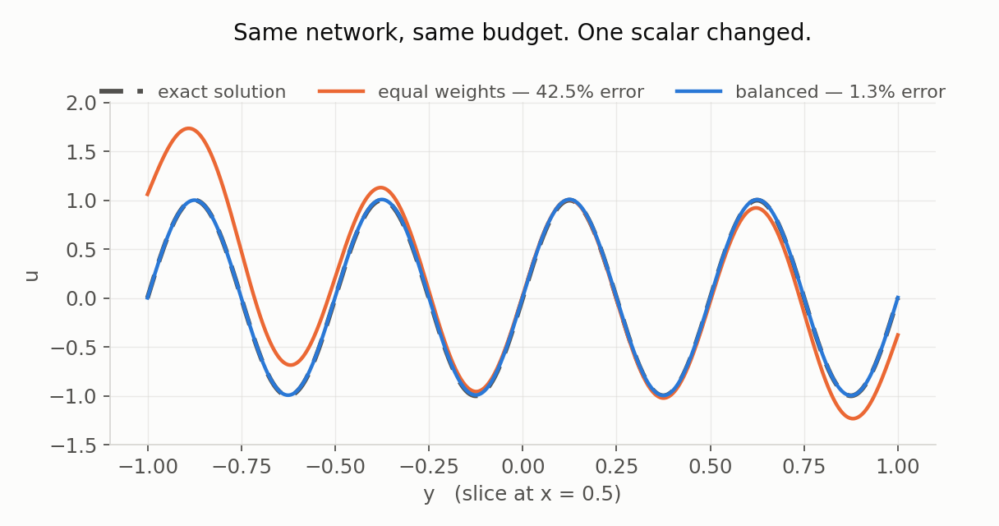
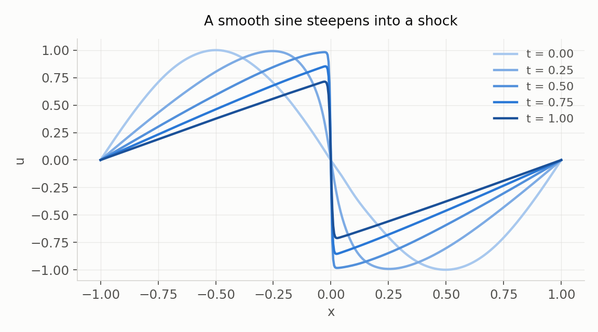

# Making PINNs Work

**A practical course on why physics-informed neural networks fail to converge — and what to do about it.**

Prof. Dr. Dmitry Mikhaylov · Abu Dhabi Maritime Academy (AD Ports Group) · Kyrgyz National University

[](https://doi.org/10.5281/zenodo.22342668)
[](https://orcid.org/0009-0009-2108-6820)

---

Most material on physics-informed neural networks teaches the happy path: here is the
equation, here is the loss, here is the solution. Then you write your first PINN, the loss
does not go down — or worse, it goes down and the answer is still wrong — and you are on
your own.

The methods that fix this exist and are well published. They are scattered across papers and
rarely taught together. This course collects them.

Every module is a runnable notebook on an open benchmark problem, in plain PyTorch, with no
PINN library between you and the mathematics. Each is built around a specific way PINNs fail,
how to diagnose it, and what to do. **Every notebook is committed with its outputs**, so you
can read the results without running anything.



*Module 02. Same network, same data, same budget — only the weight on the boundary term
differs. Equal weights give 41% error; a tuned constant gives 1%. And the bad model has the
**lower** equation loss. Judging a PINN by its training curve is how you ship it anyway.*

## Prerequisites

You can train an ordinary neural network in PyTorch and you know what a partial differential
equation is. No computational physics background needed. A willingness to debug something
that is not converging is essential.

## Modules

| | Module | Benchmark problem | |
|---|---|---|---|
| 00 | When a PINN is the right tool — and when it is not | — | *coming* |
| 01 | [A minimal PINN from scratch](01_burgers_from_scratch.ipynb) | Burgers | ready |
| 02 | [Why your loss will not go down: balancing the terms](02_loss_balancing.ipynb) | Helmholtz | ready |
| 03 | Spectral bias: why high frequencies never arrive | multiscale Poisson | *coming* |
| 04 | Causality in time-dependent problems | Allen–Cahn | *coming* |
| 05 | Boundary conditions: hard versus soft | Poisson, mixed BC | *coming* |
| 06 | Where to put the collocation points | Burgers with a shock | *coming* |
| 07 | Inverse problems: recovering what you cannot measure | heat conductivity | *coming* |
| 08 | How to know the solution is right | all of the above | *coming* |
| 09 | From notebook to deployment | CPU inference | *coming* |

Modules marked *coming* are planned, not abandoned. The syllabus is published in full so you
can see where this is going.



*Module 01. A PINN written from scratch in about eighty lines. Measured against the exact
Cole-Hopf solution, the relative L2 error runs between 0.08% and 0.4% across the time range.
Every figure in this repository is produced by the notebook beside it.*

## The two ideas the course is built on

**Module 00 talks you out of it.** A large share of PINN failures are problems that should
never have been given to a PINN. If a well-posed forward problem has a working solver, a PINN
will usually be slower and less accurate. PINNs earn their place on inverse problems, sparse
and noisy data, and where you need a differentiable, fast surrogate.

**Module 02 shows that the loss is not the error.** Five seeds on the Helmholtz benchmark,
with the constant weight tuned on a held-out seed first:

| weighting of the boundary term | mean rel. L2 error | sd |
|---|---|---|
| equal weights, lambda = 1 | 0.4066 | 0.1282 |
| tuned constant, lambda = 1000 | **0.0105** | **0.0009** |
| gradient-based (annealing) | 0.0243 | 0.0182 |

Three things worth noticing, and the second is not what the literature usually leads with:

1. One scalar moves the error from 41% to 1%, everything else held fixed. The weighting is
   the dominant hyperparameter.
2. A **tuned constant beats the adaptive scheme** here, and is twenty times more repeatable.
   The honest case for gradient-based weighting is not accuracy — it is that it lands in the
   right regime without a sweep.
3. At lambda = 1 the PDE loss is 0.4076; at lambda = 1000 it is 0.4435. The worse model has
   the lower loss. Module 08 is about what to watch instead.

### Checking the numbers

The five-seed table was quoted in the notebook but not produced by it. It now is:
`scripts/02_five_seeds.py` re-runs the three weightings for seeds 1–5 (the seed sets the
network initialisation; the collocation and boundary points are the notebook's fixed set)
and writes every run to `results/02_five_seeds.json`. The re-run reproduces the table above
to all four decimals — the training is deterministic on CPU. The ± column is the sample
standard deviation over n = 5; errors are relative L2 on a 200 × 200 grid.

| seed | equal weights | tuned constant | gradient-based | adaptive λ ended at |
|---|---|---|---|---|
| 1 | 0.4250 | 0.0097 | 0.0128 | 4332 |
| 2 | 0.4301 | 0.0118 | **0.0089** | 5269 |
| 3 | 0.3771 | 0.0106 | 0.0483 | 3880 |
| 4 | 0.5791 | 0.0106 | 0.0394 | 3786 |
| 5 | 0.2216 | 0.0097 | 0.0121 | 5080 |

Read pair by pair, the second conclusion is narrower than the means suggest. The tuned
constant beats the adaptive scheme on **4 of 5 seeds**, and on seed 2 it loses (0.0118
against 0.0089). On three seeds the two are within 0.004 of each other; the 0.0243 mean is
made by seeds 3 and 4, where annealing landed at 4–5 % error. So the adaptive scheme is not
systematically worse — it is *occasionally* much worse, which is what the sd of 0.0182 was
saying. Note also that annealing settles at λ ≈ 3800–5300, four to five times the tuned
1000, and is no better for it: the basin of good constants is wide, and the two failures
are not a wrong λ but a bad path to it.

The "loss is not the error" point holds across all fifteen runs, not just the one in the
notebook. Ranked by final PDE loss, the best of the fifteen is seed 5 with equal weights
(loss 0.17) — a model with **22 % error**. The five tuned runs, all near 1 % error, sit at
PDE losses of 0.30–0.60.

Module 01 is checked against the exact Cole-Hopf solution, not against a plausible-looking
plot. Where this course makes a claim, the notebook next to it reproduces the number, and
`tests/test_readme_numbers.py` pins every number on this page to the notebook outputs and
the results file.

## Running the notebooks

```bash
pip install -r requirements.txt
jupyter lab
```

Everything runs on a laptop CPU. Module 01 takes about two minutes, module 02 about forty
seconds per configuration.

## Key references

- Raissi, Perdikaris & Karniadakis. Physics-informed neural networks. *J. Comput. Phys.* **378** (2019) 686-707.
- Wang, Teng & Perdikaris. Understanding and mitigating gradient flow pathologies in PINNs. *SIAM J. Sci. Comput.* **43** (2021) A3055.
- Krishnapriyan et al. Characterizing possible failure modes in PINNs. *NeurIPS* (2021). [arXiv:2109.01050](https://arxiv.org/abs/2109.01050)
- Wang, Sankaran & Perdikaris. Respecting causality for training PINNs. *CMAME* **421** (2024) 116813. [arXiv:2203.07404](https://arxiv.org/abs/2203.07404)
- Wu, Zhu, Tan, Kartha & Lu. Non-adaptive and residual-based adaptive sampling for PINNs. *CMAME* **403** (2023) 115671. [arXiv:2207.10289](https://arxiv.org/abs/2207.10289)
- Karniadakis et al. Physics-informed machine learning. *Nature Reviews Physics* **3** (2021) 422-440.

## Related

For physics-informed neural networks applied across industrial domains — optics, acoustics,
thermal, fluids, electromagnetics, mechanics — see my book *Physics-Informed Neural Networks
for Industrial Applications* (Springer). This course is about making the method converge; the
book is about where to point it.

Two applications of the same discipline to real problems:

- [**navierpinn-mineral-ore-body-reconstruction**](https://github.com/drdmitrymikhaylov/navierpinn-mineral-ore-body-reconstruction)
  — ore-body modelling with a PINN solving linear-elasticity equilibrium, inside a
  Qt/PyVista 3D workspace.
- [**acousticpinn-cough-diagnosis**](https://github.com/drdmitrymikhaylov/acousticpinn-cough-diagnosis)
  — the same reporting discipline applied to audio: cough detection and dry/wet cough typing
  on open data, cross-validated, with the inter-rater ceiling measured and shown.

## Licence

Code: MIT. Course text, slides and figures: CC BY 4.0.

## Citing

A DOI is issued for each release via Zenodo. The badge above is the *concept* DOI — it
always resolves to the latest version. To cite a specific one, use its own version DOI
(v0.1 is [10.5281/zenodo.22342669](https://doi.org/10.5281/zenodo.22342669)).
