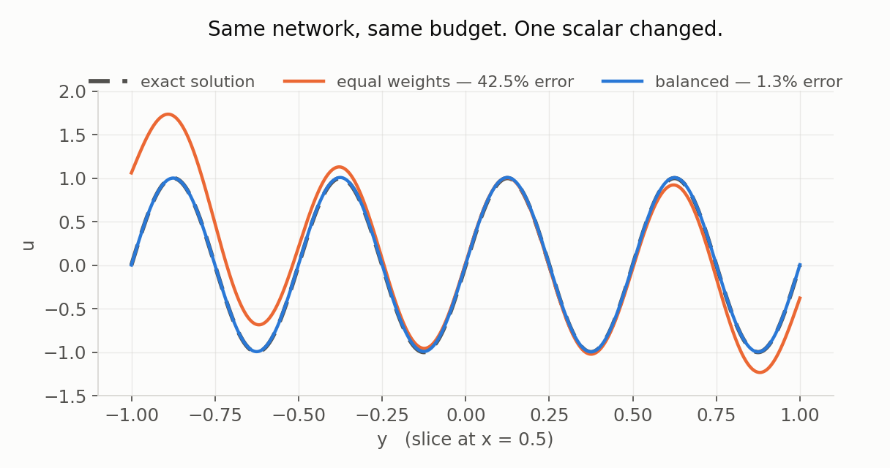
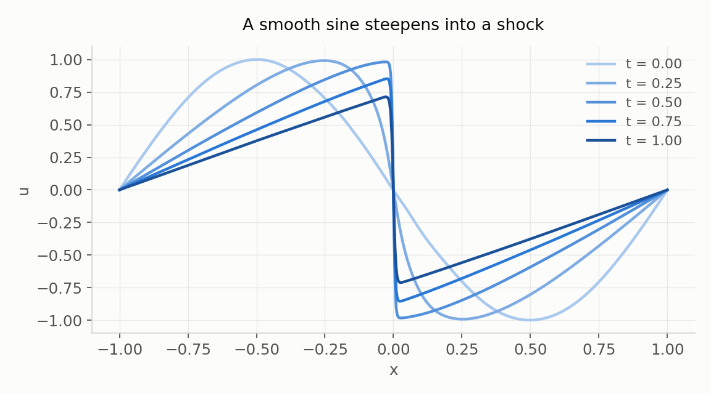

# Making PINNs Work

**A practical course on why physics-informed neural networks fail to converge — and what to do about it.**

Prof. Dr. Dmitry Mikhaylov · Abu Dhabi Maritime Academy (AD Ports Group) · Kyrgyz National University

[](https://doi.org/10.5281/zenodo.22342668)
[](https://orcid.org/0009-0009-2108-6820)

---

Most material on physics-informed neural networks teaches the happy path. Here is the
equation, here is the loss, here is the solution. Then you write your first PINN and the loss
does not go down. Or worse, it goes down and the answer is still wrong, and you are on your
own.

The methods that fix this exist and are well published. They are scattered across papers and
rarely taught together. This course collects them.

Every module is a runnable notebook on an open benchmark problem, in plain PyTorch, with no
PINN library between you and the mathematics. Each is built around a specific way PINNs fail,
how to diagnose it, and what to do. **Every notebook is committed with its outputs**, so you
can read the results without running anything.



*Module 02. Same network, same data, same budget — only the weight on the boundary term
differs. Equal weights give 41% error; a tuned constant gives 1%. And the bad model has the
**lower** equation loss. Judging a PINN by its training curve is how you ship it anyway.*

## Who I built this for

I teach physics-informed AI as a professor at Kyrgyz National University and at the Abu Dhabi Maritime Academy, and I have lectured as an invited speaker at the Fletcher School of Tufts University, the University of Sydney, City University of Hong Kong, Huazhong University of Science and Technology, the University of International Business and Economics in Beijing, Dankook University, Vietnam National University Ho Chi Minh City, COMSATS University Islamabad and Tashkent State Agrarian University. This course grew out of those lectures. It is built around the failures that stop most people, and it shows how to turn each one into a network that works. It is the companion to the Kyrgyz-language AI textbook published at KNU in 2026.

## Who this is for

You can train an ordinary neural network in PyTorch and you know what a partial differential
equation is. No computational physics background is needed. A willingness to debug something
that is not converging is essential.

## Syllabus

| | Module | Benchmark problem | |
|---|---|---|---|
| 00 | When a PINN is the right tool — and when it is not | — | *coming* |
| 01 | [A minimal PINN from scratch](01_burgers_from_scratch.ipynb) | Burgers | ready |
| 02 | [Why your loss will not go down: balancing the terms](02_loss_balancing.ipynb) | Helmholtz | ready |
| 03 | Spectral bias: why high frequencies never arrive | multiscale Poisson | *coming* |
| 04 | Causality in time-dependent problems | Allen-Cahn | *coming* |
| 05 | Boundary conditions: hard versus soft | Poisson, mixed BC | *coming* |
| 06 | Where to put the collocation points | Burgers with a shock | *coming* |
| 07 | Inverse problems: recovering what you cannot measure | heat conductivity | *coming* |
| 08 | How to know the solution is right | all of the above | *coming* |
| 09 | From notebook to deployment | CPU inference | *coming* |

Modules marked *coming* are planned, not abandoned. The syllabus is published in full so you
can see where this is going.

## Module 00 — talking you out of it

A large share of PINN failures are problems that should never have been given to a PINN. If
a well-posed forward problem has a working solver, a PINN will usually be slower and less
accurate. PINNs earn their place on inverse problems, sparse and noisy data, and where you
need a differentiable, fast surrogate.

## Module 01 — Burgers from scratch



*A PINN written from scratch in about eighty lines. Measured against the exact Cole-Hopf
solution, the relative L2 error runs between 0.08% and 0.4% across the time range. Every
figure in this repository is produced by the notebook beside it.*

Module 01 is checked against the exact Cole-Hopf solution, not against a plausible-looking
plot.

## Module 02 — the loss is not the error

Five seeds on the Helmholtz benchmark, with the constant weight tuned on a held-out seed
first:

| weighting of the boundary term | mean rel. L2 error | sd |
|---|---|---|
| equal weights, lambda = 1 | 0.4066 | 0.1282 |
| tuned constant, lambda = 1000 | **0.0105** | **0.0009** |
| gradient-based (annealing) | 0.0243 | 0.0182 |

Three things are worth noticing. The second is not what the literature usually leads with.

1. One scalar moves the error from 41% to 1%, everything else held fixed. The weighting is
   the dominant hyperparameter.
2. A **tuned constant beats the adaptive scheme** here, and is twenty times more repeatable.
   What gradient-based weighting can fairly claim is not accuracy. It is that it lands in
   the right regime without a sweep.
3. At lambda = 1 the PDE loss is 0.4076; at lambda = 1000 it is 0.4435. The worse model has
   the lower loss. Module 08 is about what to watch instead.

## Per-seed check

The five-seed table was quoted in the notebook but not produced by it. It now is.
`scripts/02_five_seeds.py` re-runs the three weightings for seeds 1 to 5 and writes every
run to `results/02_five_seeds.json`. The seed sets the network initialisation; the
collocation and boundary points are the notebook's fixed set. The re-run reproduces the
table above to all four decimals, because the training is deterministic on CPU. The sd
column is the sample standard deviation over n = 5. Errors are relative L2 on a 200 × 200
grid.

| seed | equal weights | tuned constant | gradient-based | adaptive λ ended at |
|---|---|---|---|---|
| 1 | 0.4250 | 0.0097 | 0.0128 | 4332 |
| 2 | 0.4301 | 0.0118 | **0.0089** | 5269 |
| 3 | 0.3771 | 0.0106 | 0.0483 | 3880 |
| 4 | 0.5791 | 0.0106 | 0.0394 | 3786 |
| 5 | 0.2216 | 0.0097 | 0.0121 | 5080 |

Taken pair by pair, the second conclusion is narrower than the means suggest. The tuned
constant beats the adaptive scheme on **4 of 5 seeds**. On seed 2 it loses (0.0118 against
0.0089). On three seeds the two are within 0.004 of each other. The 0.0243 mean is made by
seeds 3 and 4, where annealing landed at 4 to 5 % error. So the adaptive scheme is not
systematically worse. It is *occasionally* much worse, which is what the sd of 0.0182 was
saying. Note also that annealing settles at λ ≈ 3800 to 5300, four to five times the tuned
1000, and is no better for it. Two sentences stood here until 9 October 2026: "the basin of
good constants is wide" and "the two failures are not a wrong λ but a bad path to it". Neither
had a run behind it. [Exercises 2 and 3, run](#exercises-2-and-3-run) has the runs, and
neither sentence survives as written.

The "loss is not the error" point holds across all fifteen runs, not just the one in the
notebook. Ranked by final PDE loss, the best of the fifteen is seed 5 with equal weights
(loss 0.17), a model with **22 % error**. The five tuned runs, all near 1 % error, sit at PDE
losses of 0.30 to 0.60.

Where this course makes a claim, the notebook next to it reproduces the number, and
`tests/test_readme_numbers.py` pins every number on this page to the notebook outputs and
the results file.

## Exercises 2 and 3, run

The notebook leaves two questions to the reader. Exercise 2 asks how wide the basin of good
constant weights is. Exercise 3 asks what happens if λ is fixed from step one at the value
annealing ended at. The section above answered both in a sentence each without running either.
`scripts/02_lambda_basin.py` now runs them on the same five seeds, with the training loop
imported from `scripts/02_five_seeds.py`. That is 50 runs, done on 9 October 2026, all kept in
`results/02_lambda_basin.json`. The λ = 1000 row was trained again as a control and reproduces
the 22 September runs bit for bit. The λ = 1 row is the stored one.

| constant λ | mean rel. L2 error | sd | min | max | seeds under 2 % |
|---|---|---|---|---|---|
| 1 | 0.4066 | 0.1282 | 0.2216 | 0.5791 | 0 of 5 |
| 10 | 0.1291 | 0.0543 | 0.0516 | 0.1896 | 0 of 5 |
| 30 | 0.0461 | 0.0082 | 0.0362 | 0.0575 | 0 of 5 |
| 100 | 0.0355 | 0.0160 | 0.0210 | 0.0623 | 0 of 5 |
| 300 | 0.0157 | 0.0046 | 0.0108 | 0.0219 | 4 of 5 |
| 1000 | 0.0105 | 0.0009 | 0.0097 | 0.0118 | 5 of 5 |
| 3000 | 0.0156 | 0.0050 | 0.0093 | 0.0219 | 4 of 5 |
| 10000 | 0.0424 | 0.0185 | 0.0239 | 0.0682 | 0 of 5 |
| 30000 | 0.8332 | 0.3861 | 0.3314 | 1.3745 | 0 of 5 |
| 100000 | 0.9999 | 0.0001 | 0.9997 | 1.0000 | 0 of 5 |

1. **The basin is about a decade wide.** Only λ = 1000 is under 2 % on all five seeds. 300 and
   3000 pass on four seeds each, at a mean of 1.6 % against 1.0 %. What is wide is the regime
   where nothing breaks: every weight from 30 to 10 000 lands between 0.9 % and 7 % on every
   seed.
2. **The two sides are not alike.** Too small a weight costs gradually: 41 % at λ = 1, 13 % at
   10, 4.6 % at 30. Too large a weight is a cliff: 4.2 % at 10 000, then 83 % at 30 000, which
   is worse than no weighting at all on four seeds of five. At 100 000 every seed returns the
   zero function: boundary loss below 2 × 10⁻⁶, PDE loss between 6895 and 6896 (u = 0 scores
   6896 on these collocation points), error 100 %. A sweep that walks up from λ = 1 and stops
   at the first good value never sees that side.
3. **1000 is the best grid value on four seeds.** Seed 5 prefers 3000 (0.0093 against 0.0097).

Exercise 3, for every seed, against the annealed run that ended at the same λ:

| seed | λ annealing ended at | annealed | constant at that λ from step one | constant λ = 1000 |
|---|---|---|---|---|
| 1 | 4332 | 0.0128 | 0.0590 | 0.0097 |
| 2 | 5269 | 0.0089 | 0.0297 | 0.0118 |
| 3 | 3880 | 0.0483 | 0.0283 | 0.0106 |
| 4 | 3786 | 0.0394 | 0.0270 | 0.0106 |
| 5 | 5080 | 0.0121 | 0.0112 | 0.0097 |

- The exercise as set (seed 1, λ = 4332) trains, and ends at 5.9 % error where the annealed run
  reached 1.3 %: 4.6 times worse. The same holds on seed 2 (3.0 % against 0.9 %). There the
  gradual update is doing real work.
- On seeds 3 and 4, the two annealing failures, the constant is *better* than the annealed run
  (2.8 % against 4.8 %, 2.7 % against 3.9 %). So the path did cost something there. But 2.7 to
  2.8 % is still more than twice the 1.1 % of λ = 1000 on those seeds, so the λ is wrong as
  well. "Not a wrong λ but a bad path to it" was half right.
- Over the five seeds the constant at the endpoint averages 3.1 % and the annealed runs 2.4 %.
  The constant is ahead on three seeds (on seed 5 by 0.0009), and the mean difference is +0.007
  ± 0.027. Five seeds do not separate them. Both are well behind the tuned constant, which
  beats the endpoint constant on all five seeds, by a factor of three on average.
- Annealing ends at λ = 3786 to 5269. That is above every seed's best grid value, outside the 2
  % basin (one seed of five passes at its own endpoint), and six to eight times below the 30
  000 where training collapses. "It lands in the right regime without a sweep" still stands.
  "And is no better for it" understated the matter: held constant, the place it lands is three
  times worse than the tuned value.

**What this does not show.** One problem, one network, one budget (4000 Adam steps at 10⁻³).
With more steps or a learning-rate schedule the large-λ side may recover, so the cliff is a
statement about this budget. The grid moves in half decades, so the edges of the basin are
known to a factor of three, no better. With five seeds, the 4-of-5 rows could be 5-of-5 or
3-of-5 on another five. The λ = 1000 row was chosen on a held-out seed before these runs. No
other row has that protection, and the held-out sweep itself is not in this repository.
`tests/test_lambda_basin.py` pins this section to the results file.

## Running the notebooks

```bash
pip install -r requirements.txt
jupyter lab
```

Everything runs on a laptop CPU. Module 01 takes about two minutes, module 02 about forty
seconds per configuration.

## What changed since v0.1

The first release of this course made a headline claim that did not survive its own
lesson. It said gradient-based weighting cut the Helmholtz error from 42.5% to 1.3%, a
factor of 33. That came from one seed, compared against λ = 1 with no tuning at all, and
the credit went to the adaptive scheme when most of the gain comes from having any
sensible λ. I re-ran it on 4 September 2026 on a laptop CPU, PyTorch 2.9.1: a sweep
of the constant weight on a held-out seed (99), then five seeds for each of the three
weightings. The tables above are what came out, and the conclusion changed.

Two smaller corrections from the same pass. Module 01 in v0.1 checked only the residual and
whether a shock appeared; it is now measured against the closed-form Cole-Hopf solution.
And the v0.1 text said L-BFGS finished "in about a third of the wall time" of Adam. The
timings were 40.1 s against 89.6 s, which is 45%, not a third. The v0.1 notebooks had also
been committed unexecuted, so GitHub showed code and no results. They are now committed
with outputs.

## Reading list

- Raissi, Perdikaris & Karniadakis. Physics-informed neural networks. *J. Comput. Phys.* **378** (2019) 686-707.
- Wang, Teng & Perdikaris. Understanding and mitigating gradient flow pathologies in PINNs. *SIAM J. Sci. Comput.* **43** (2021) A3055.
- Krishnapriyan et al. Characterizing possible failure modes in PINNs. *NeurIPS* (2021). [arXiv:2109.01050](https://arxiv.org/abs/2109.01050)
- Wang, Sankaran & Perdikaris. Respecting causality for training PINNs. *CMAME* **421** (2024) 116813. [arXiv:2203.07404](https://arxiv.org/abs/2203.07404)
- Wu, Zhu, Tan, Kartha & Lu. Non-adaptive and residual-based adaptive sampling for PINNs. *CMAME* **403** (2023) 115671. [arXiv:2207.10289](https://arxiv.org/abs/2207.10289)
- Karniadakis et al. Physics-informed machine learning. *Nature Reviews Physics* **3** (2021) 422-440.

## Elsewhere

For physics-informed neural networks applied across industrial domains — optics, acoustics,
thermal, fluids, electromagnetics, mechanics — see my book *Physics-Informed Neural Networks
for Industrial Applications* (Springer). This course is about making the method converge.
The book is about where to point it.

Two applications of the same discipline to real problems:

- [**navierpinn-mineral-ore-body-reconstruction**](https://github.com/drdmitrymikhaylov/navierpinn-mineral-ore-body-reconstruction)
  — ore-body modelling with a PINN solving linear-elasticity equilibrium, inside a
  Qt/PyVista 3D workspace.
- [**acousticpinn-cough-diagnosis**](https://github.com/drdmitrymikhaylov/acousticpinn-cough-diagnosis)
  — the same reporting discipline applied to audio: cough detection and dry/wet cough typing
  on open data, cross-validated, with the inter-rater ceiling measured and shown.

## Licences

Code: MIT. Course text, slides and figures: CC BY 4.0.

## Citing

A DOI is issued for each release via Zenodo. The badge above is the *concept* DOI. It
always resolves to the latest version. To cite a specific one, use its own version DOI
(v0.1 is [10.5281/zenodo.22342669](https://doi.org/10.5281/zenodo.22342669)).
